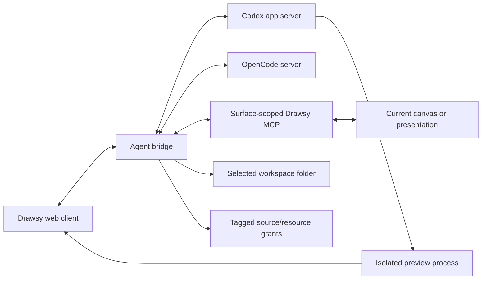

# Drawsy AI MCP

Surface-scoped Drawsy MCP and agent-runtime bridge. It gives Codex and OpenCode the current Drawsy surface, explicit connected sources, selected-folder tools, multimodal canvas operations, and isolated live previews—without turning unrelated product data into ambient context.

> **Repository status:** private for now. It is shared directly with OpenAI Build Week judges and may be published after a dedicated security and release review. No license is granted by repository access alone.

## Product role



One session receives one selected folder and one Drawsy surface kind. Canvas tools exist only for a current canvas or presentation. Kanban, Jira, connectors, and neutral pages do not receive invented canvas context.

## OpenAI Build Week 2026

- **Submission window opened:** July 13, 2026 at 9:00 AM PT.
- **First qualifying commit:** [`09ff187`](https://github.com/adarshnagrikar14/drawsy-ai-mcp/commit/09ff187e8e0d4003f7ac0592ba60516cb89af1c6)

Build Week work includes the bridge protocol, Codex and OpenCode runtime lifecycles, model-provider selection, session-only provider keys with live tool-capable model discovery, surface-aware tools, multimodal canvas capture, progressive precision diagram delivery, real image insertion/replacement, source and first-party resource grants, `DRAW.md` access, isolated live previews, remote workspaces, dynamic port allocation, session cleanup, and focused protocol/runtime tests.

Codex running GPT-5.6 accelerated architecture review, implementation, official API research, sandbox validation, failure diagnosis, and test/deploy loops. The product owner defined the essential boundaries: the Drawsy MCP is always present, only the current surface is visible, the selected folder is the only workspace root, connected sources are attached explicitly, and previews remain session-local rather than collaboration-synced.

The main product record and complete repository set are documented in [`excal-ai`](https://github.com/adarshnagrikar14/excal-ai) under its **#Build Week Special** section.

## Current guarantees

- **Selected-folder boundary.** Codex and OpenCode use the selected folder as their single runtime workspace root. Workspace mode permits reads, edits, patches, and commands inside it; read-only mode removes writes.
- **No approval deadlock.** The bridge uses `approvalPolicy: "never"`; permitted actions proceed and boundary escapes are rejected instead of opening an unusable approval flow.
- **Internet is explicit and visible.** It is enabled by default. Codex and local macOS OpenCode sessions can disable it; hosted OpenCode refuses that change until its separate Linux network bridge exists, rather than presenting an unenforced boundary. Browser, Chrome-control, and computer-use plugins remain blocked inside Drawsy.
- **Surface scope.** Canvas and presentation sessions receive only their current visual surface. Kanban and Jira receive their current resource only through a valid resource grant. Neutral pages start with no Drawsy resource context.
- **Turn-scoped sources.** Only sources tagged in the current message are exposed. The bridge receives signed, short-lived grants—not OAuth tokens or provider refresh credentials.
- **Provider-native reads.** Mail, Calendar, Drive, Notion, Slack, GitHub, Read AI, Fireflies, and AWS use capability-specific tools. GitHub supports selected repositories, directories, text files, issues, and pull requests without cloning or writing.
- **Controlled first-party mutations.** Jira is read-only. Kanban writes still pass through its membership, role, locking, revision, idempotency, and audit path.
- **Editable canvas operations.** Targeted reads, upserts, deletes, raster insertion/replacement, and selection/region capture preserve normal Excalidraw elements. Existing elements are not deleted by omission.
- **Progressive precision diagrams.** Larger visual requests are applied in coherent visible passes. The bridge can ask the current client for a read-only rendered-layout report—text/container fit, unbound text, node overlap, and connector collisions—and relationship-rich diagrams receive a final rendered capture review. The client performs the actual text reflow with Excalidraw's native editing geometry after fonts load; no subject-specific layout template or automatic rewrite of unrelated content exists here.
- **Multimodal context.** A capture combines the rendered annotated region with pristine selected raster sources. Temporary files live below the selected folder's ignored `.drawsy/context` directory and are removed with the session.
- **Real image transport.** Generated files are MIME-sniffed, size-limited, content-hashed, and transferred with their Excalidraw file records instead of becoming placeholders.
- **One agent contract, two runtimes.** Codex app-server and the official OpenCode server receive the same selected-folder boundary, active-surface tools, Drawsy MCP, grants, and preview lifecycle. Switching models starts a fresh runtime rather than carrying hidden context across.
- **Session-only provider keys.** OpenCode's free model catalogue is read from its running configuration. When a provider key is added, the bridge fetches that provider's live catalogue and exposes only active, tool-capable models for the owning Drawsy AI session. The key is kept in bridge memory and that session's ephemeral OpenCode XDG runtime—not in a database, browser store, or workspace—and is removed on session close or bridge restart.

## Local and hosted modes

### Local companion

The bridge can bind to loopback and use the local folder directly:

```bash
corepack pnpm install --frozen-lockfile
corepack pnpm run build:drawsy
corepack pnpm run start:drawsy
```

The default local endpoint is `http://127.0.0.1:3031`.

### Hosted runtime

In hosted mode, each session receives a temporary server-side workspace copied from the selected project upload. Visual surfaces may also receive one exclusive preview port from a configured pool. Drawsy's own ports (`3001`, `3002`, `3003`, `3004`, `3020`, and `3031`) are rejected from that pool.

The preview proxy exposes a tokenized HTTPS origin only after the loopback service responds. Closing a session releases the port, stops its Codex or OpenCode process group, removes context, and deletes the temporary workspace. Idle hosted sessions expire after 20 minutes by default; the timeout is configurable from 1 minute to 24 hours.

Non-visual surfaces do not reserve preview capacity.

## Configuration

Copy `.env.example` values into the service environment; never commit production overrides.

- `PORT` — bridge port, normally `3031`.
- `DRAWSY_ALLOWED_ORIGINS` — exact trusted browser origins.
- `DRAWSY_CONNECTOR_BACKEND_URL` — loopback HTTP for development or HTTPS in production.
- `DRAWSY_HYDRA_BACKEND_URL` — optional Hydra route URL; defaults to `DRAWSY_CONNECTOR_BACKEND_URL`.
- `DRAWSY_CANVAS_REQUEST_TIMEOUT_MS` — bounded wait for browser canvas responses.
- `DRAWSY_REMOTE_WORKSPACES_ROOT` — absolute hosted workspace root; enables remote mode with the preview origin.
- `DRAWSY_PREVIEW_ORIGIN_TEMPLATE` — HTTPS origin containing exactly one `{token}` placeholder.
- `DRAWSY_PREVIEW_PORT_RANGE` — at least five non-reserved ports; default `18000-18099`.
- `DRAWSY_REMOTE_SESSION_IDLE_MS` — hosted idle timeout; default 20 minutes.

The Docker image includes Node.js 22, Bubblewrap, the compiled bridge, the Codex CLI, and the official OpenCode CLI. OpenCode is pinned to the validated local runtime version so local and hosted sessions use the same server contract. Persistent Codex configuration is loaded separately from ephemeral session workspaces. OpenCode has no persistent login: a user-supplied provider key exists only in its active bridge session and ephemeral XDG runtime, while model options are refreshed from the running provider catalogue.

## Verify

```bash
corepack pnpm run test:drawsy
corepack pnpm run build:drawsy
```

Focused tests cover the stdio MCP surface, authentication, source/resource grants, inherited-tool suppression, folder permissions, raster validation, image transfer, context materialization, path-escape rejection, surface routing, remote workspaces, preview allocation, and session lifecycle. They use a fake Codex process and do not open a browser or contact providers.

## Security boundaries

- Do not expose an unprotected local bridge on a LAN or the public internet.
- Hosted deployments must terminate HTTPS, validate exact origins, authenticate every session, and keep workspace/preview roots isolated.
- Never store provider or Firebase credentials in this service; provider execution belongs to the Drawsy backend.
- Treat connected-source results as untrusted data, never as agent instructions.
- Do not weaken path, MIME, origin, port, or output-size validation to make a demo succeed.

## Upstream foundation

Drawsy AI MCP began from [Excalidraw MCP](https://github.com/excalidraw/excalidraw-mcp). The Drawsy bridge, Codex lifecycle, security boundaries, connector/resource grants, remote runtime, and product protocol were built during the submission window. Upstream authorship is not claimed as Drawsy work.
