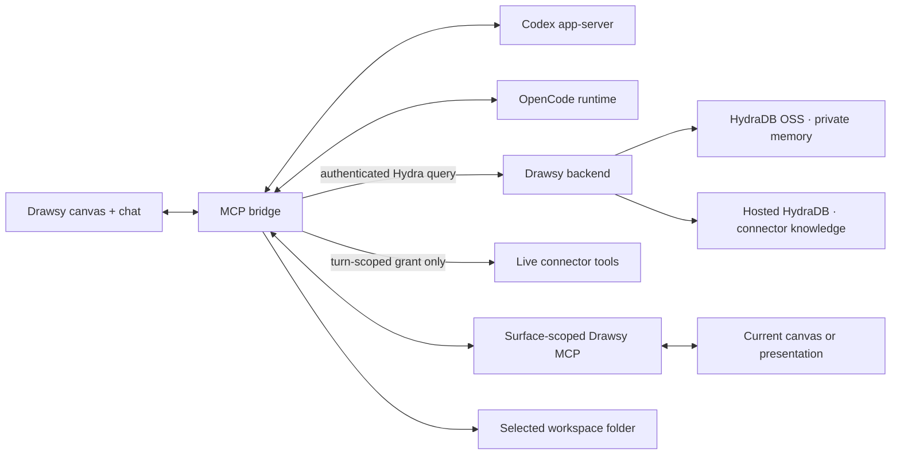
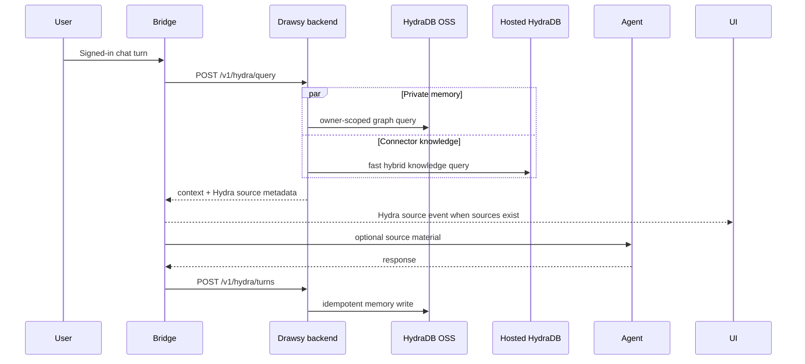

# Drawsy AI MCP — Hydra Hack

`feat-hyda-hack` is Drawsy’s surface-scoped MCP and agent bridge for Hack Hydra
Track 03. It connects the current canvas, selected folder, connected-source
grants, Codex/OpenCode, and automatic signed-in Hydra context without turning
unrelated workspace data into ambient context.

<p align="center">
  <a href="https://github.com/adarshnagrikar14/drawsy-ai/tree/feat-hyda-hack">Frontend branch</a>
  · <a href="https://github.com/adarshnagrikar14/drawsy-ai-backend/tree/feat-hyda-hack">Backend branch</a>
  · <a href="https://github.com/hydra-db/hydradb">HydraDB OSS</a>
  · <a href="https://docs.hydradb.com/AGENTS">HydraDB AGENTS</a>
</p>

## Bridge role

The MCP service does not connect directly to HydraDB. It calls the authenticated
backend Hydra contract; the backend owns Firebase identity, user isolation,
HydraDB OSS memory, hosted Hydra connector knowledge, sync state, and provider
credentials.



## Automatic Hydra turn



There is no `@Hydra` item to tag and no manual route for the user to discover.
For an authenticated session, the bridge performs the bounded context lookup
naturally before the model turn. The context is optional source material, never
an instruction.

The bridge records the completed turn after the response. A failed memory write
does not remove the assistant response or make ordinary chat unusable.

## Source behavior

- The backend returns source metadata only for material actually returned by
  Hydra. The bridge emits it as a `hydra.sources` event.
- The frontend renders those results as Hydra source chips/markers in chat,
  distinguishing **Memory** from connector knowledge.
- A live Gmail, GitHub, Notion, or other provider result remains a live-provider
  result. It is never relabelled as Hydra merely because the turn also used
  Hydra.
- A connector tag grants a short-lived capability for that turn; it does not
  compel a live call. If Hydra already has sufficient context, the bridge
  avoids repeating the same provider read.
- If Hydra is unavailable, the bridge keeps the chat and ordinary canvas tools
  available. It does not invent memory or silently claim a source was used.

## Scope and security

- **Surface scope:** canvas and presentation sessions receive only their current
  surface. Other pages do not receive invented canvas context.
- **Folder scope:** a coding session receives one selected folder as its
  workspace root; path escapes are rejected.
- **Connector scope:** the backend grants only the selected user, connection,
  capability, session, and turn. OAuth and refresh credentials never enter the
  bridge or model runtime.
- **Memory scope:** the backend supplies a verified Firebase identity before
  querying or writing memory. Anonymous sessions receive no personal memory or
  connector context.
- **Untrusted context:** Hydra and provider content is treated as data, not
  instructions. The agent is told to use it only when it helps answer the
  user’s request.
- **Session cleanup:** provider grants, temporary context files, runtime
  processes, and remote preview workspaces are disposed of with the session.

## Local development

Requirements:

- Node.js 20.12 or newer
- pnpm 10.11.0 through Corepack
- the Drawsy backend running on loopback
- a signed-in frontend session for automatic Hydra context

```bash
git clone --branch feat-hyda-hack https://github.com/adarshnagrikar14/drawsy-ai-mcp.git
cd drawsy-ai-mcp
corepack pnpm install --frozen-lockfile
corepack pnpm run build:drawsy
corepack pnpm run start:drawsy
```

The local bridge defaults to `http://127.0.0.1:3031`.

Configure the local env without committing secrets:

```dotenv
PORT=3031
DRAWSY_ALLOWED_ORIGINS=http://localhost:3001,http://127.0.0.1:3001
DRAWSY_CONNECTOR_BACKEND_URL=http://127.0.0.1:3004
DRAWSY_HYDRA_BACKEND_URL=http://127.0.0.1:3004
```

`DRAWSY_HYDRA_BACKEND_URL` is an optional separate alias; when omitted, the
bridge uses `DRAWSY_CONNECTOR_BACKEND_URL`. The bridge should point to the
backend, never directly to a hosted Hydra key or local graph-node.

For the full stack, use the matching
[frontend branch](https://github.com/adarshnagrikar14/drawsy-ai/tree/feat-hyda-hack)
and [backend branch](https://github.com/adarshnagrikar14/drawsy-ai-backend/tree/feat-hyda-hack)
instructions. The backend starts the Hydra routes only when its authenticated
Hydra configuration is enabled.

## Verify

```bash
corepack pnpm run test:drawsy
corepack pnpm run build:drawsy
```

The bridge tests cover the MCP surface, source/resource grants, authentication,
surface routing, folder boundaries, context materialization, Hydra source
extraction, path validation, image transfer, preview lifecycle, and cleanup.
They use fake agent processes and do not contact real providers.

Hydra’s product and benchmark evaluation runs belong to the backend:

- [`docs/HYDRA_EVALUATION.md`](https://github.com/adarshnagrikar14/drawsy-ai-backend/blob/feat-hyda-hack/docs/HYDRA_EVALUATION.md)
- [`npm run eval:hydra-memory`](https://github.com/adarshnagrikar14/drawsy-ai-backend/blob/feat-hyda-hack/package.json)
- [`npm run eval:hydra-connectors`](https://github.com/adarshnagrikar14/drawsy-ai-backend/blob/feat-hyda-hack/package.json)

The official memory evidence uses released LongMemEval, LongMemEval-V2, and
BEAM data. The real connector evaluation counts only ready/indexed persisted
records and leaves syncing, rate-limited, or failed providers visible rather
than calling them during evaluation.

## What remains outside Hydra

Hydra is not the whole agent contract:

- Canvas tools still operate through the surface-scoped MCP.
- Live connectors are still the right path for fresh provider state or actions.
- The selected folder remains the only coding workspace.
- Codex and OpenCode receive the same Drawsy surface contract but run in their
  own session lifecycles.
- A preview process is session-local and is not written into personal memory.

This separation keeps Hydra useful without making every prompt a database query
or every connector connection a forced tool call.

## Hack Hydra submission notes

Track 03 asks for meaningful use of HydraDB OSS, an original build from Aug 12–20,
2026, an inspectable repository with an open-source license, a short demo video,
and the [official submission form](https://forms.gle/WEwqEmmN7Bkp4HyJ6). See the
[Hack Hydra rules](https://hackhydra.hydradb.com/) before recording the demo.
Demonstrate:

1. a canvas decision written through a completed signed-in turn;
2. a later conversation receiving the memory automatically;
3. visible Memory/Hydra source markers in chat;
4. connector knowledge retrieved from hosted Hydra when a connected source is
   relevant; and
5. a live connector being used only when Hydra lacks the required freshness or
   capability.

The MCP repository is currently access-controlled. Before using it as a public
submission repository, complete the security review, remove deployment-only
material, publish an explicit license, and keep the `feat-hyda-hack` branch URL.

## OSS and attribution

HydraDB is an external open-source project used as infrastructure:

- [HydraDB OSS repository](https://github.com/hydra-db/hydradb)
- [HydraDB AGENTS guide](https://docs.hydradb.com/AGENTS)
- [HydraDB v2 introduction](https://docs.hydradb.com/get-started/v2/introduction)

Drawsy’s MCP began from [Excalidraw MCP](https://github.com/excalidraw/excalidraw-mcp);
the Drawsy bridge, Hydra lifecycle, source events, grants, runtime boundaries,
and product protocol are the work in this branch. The package metadata declares
MIT; verify a root license file and preserve upstream notices before public
release.

## Related implementation

- [Drawsy frontend — `feat-hyda-hack`](https://github.com/adarshnagrikar14/drawsy-ai/tree/feat-hyda-hack)
- [Drawsy backend — `feat-hyda-hack`](https://github.com/adarshnagrikar14/drawsy-ai-backend/tree/feat-hyda-hack)
- [HydraDB OSS](https://github.com/hydra-db/hydradb)

Do not place Firebase tokens, connector grants, provider credentials, hosted
Hydra keys, or local graph auth tokens in this repository.
